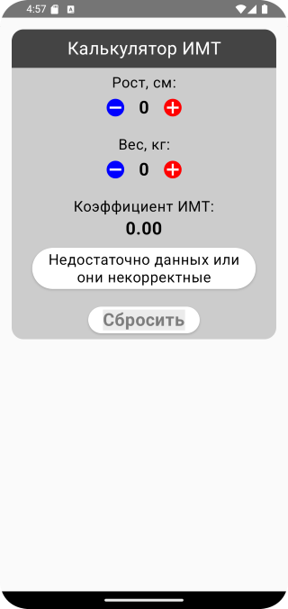
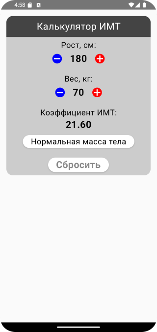
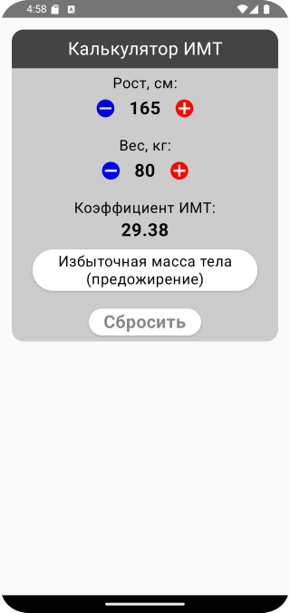
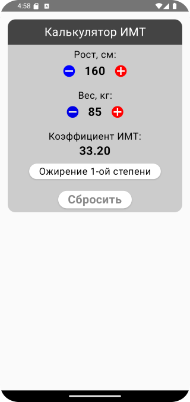
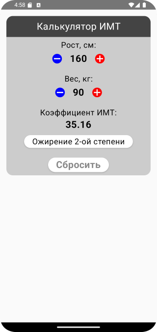
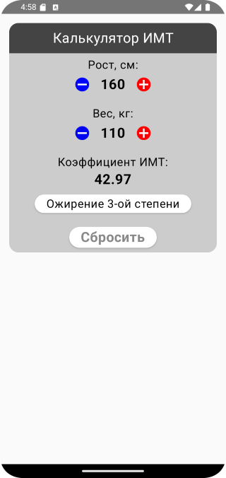

# Домашнее задание по теме "Unidirectional data flow. Composition local"

## Приложение «Расчет ИМТ»

На основе всего пройденного материала необходимо написать приложение для расчета индекса массы тела. Индекс массы тела (ИМТ) — это показатель, который используется для скрининга и определения степени избыточности веса или ожирения. Индекс массы тела рассчитывается по следующей формуле:

$$ ИМТ = m/h^2 $$

Где m - масса тела в килограммах, а h - рост в метрах.

Интерпретация результатов происходит в соответствии с данной таблицей:

Необходимо сверстать пользовательский интерфейс, включающий в себя следующие необходимые элементы:

- компонент `Text` для ввода и вывода значения роста;
- компонент `Text` для ввода и вывода значения массы;
- компонент `Text` для вывода значения ИМТ;
- компонент `Text` для вывода интерпретации результатов расчета;
- компонент `Text`, который используется как кнопка сброса значений.

Ввод значений осуществляется следующим образом: элементы, которые отображают рост и вес должны быть кликабельны. При клике на элемент, соответствующее значение увеличивается на 5 единиц.

Все изменения на экране должны отображаться сразу же, рекомпозиция компонентов должна происходить моментально при изменении состояния значений.

Приложение должно быть написано с применением паттерна `UnidirectionalDataFlow`, при вычислениях стоит использовать производное состояние.

Примерный вариант отображения содержимого может выглядеть так:

Приложение необходимо сохранить проектом в удаленном репозитории, для проверки качества предоставить ссылку преподавателю, либо сделать скрины эмулятора при каждом шаге работы приложения или снять видео экрана при работе приложения.

## Скриншоты домашнего задания по теме "Unidirectional data flow. Composition local"

Скриншоты здесь

